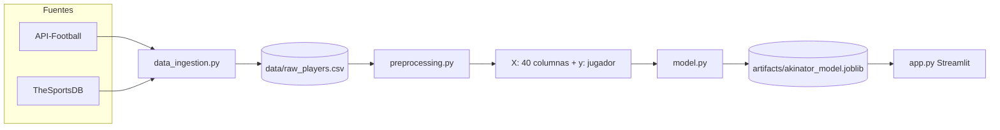

# Akinator de futbolistas (árbol de decisión + Streamlit)

Proyecto de **ciencia de datos** que simula un Akinator sobre jugadores de las **cinco grandes ligas europeas**. El flujo es:

1. **Descargar** jugadores desde **API-Football** o **TheSportsDB** → CSV crudo.  
2. **Transformar** cada jugador en **exactamente 40 variables binarias** (0/1).  
3. **Entrenar** un `DecisionTreeClassifier` de Scikit-Learn (criterio **Gini**, sin entropía manual).  
4. **Jugar** en Streamlit: en cada paso se pregunta por la **feature del nodo actual** del árbol (el split que el algoritmo CART eligió para maximizar la **reducción de impureza local**).

---

## Flujo de datos (visión general)



1. **`data_ingestion.py`** escribe filas “crudas” (nombre, equipo, liga, edad, posición, pie, foto, etc.).  
2. **`preprocessing.py`** convierte cada fila en el vector de **40 bits** definido en `BINARY_FEATURE_NAMES`.  
3. **`model.py`** ajusta el árbol, guarda un `AkinatorModelBundle` con `joblib` y expone `get_next_question` / `step_on_answer`.  
4. **`app.py`** mantiene en `st.session_state` el **índice de nodo** actual y avanza con **Sí/No**.

---

## Archivos del repositorio

| Archivo | Rol |
|--------|-----|
| [`data_ingestion.py`](data_ingestion.py) | Descarga jugadores (big 5), normaliza JSON → DataFrame, guarda `data/raw_players.csv`. Incluye `api_json_to_dataframe` (API-Football) y `thesportsdb_json_to_dataframe` (TheSportsDB). |
| [`preprocessing.py`](preprocessing.py) | `BINARY_FEATURE_NAMES` (40 nombres fijos) y `build_xy(df)` → `X`, `y`, `meta`. Rellena nulos con 0 en las columnas finales. |
| [`model.py`](model.py) | Entrena `DecisionTreeClassifier`, persiste `artifacts/akinator_model.joblib`, `get_next_question`, `step_on_answer`, resolución de hoja → nombre/foto. |
| [`app.py`](app.py) | Interfaz Streamlit: botones Sí/No, estado del nodo, mensaje final e imagen si hay URL. |
| [`export_tree_pdf.py`](export_tree_pdf.py) | (Opcional) exporta el gráfico del árbol a PDF con Matplotlib. |
| [`.env.example`](.env.example) | Plantilla de variables de entorno para claves de API. |
| [`pyproject.toml`](pyproject.toml) | Dependencias del proyecto (gestión recomendada con **uv**). |

---

## Cómo funciona cada módulo (detalle)

### `data_ingestion.py`

- **Proveedor automático**: si `API_FOOTBALL_KEY` está definida y no es el placeholder, se usa **API-Football**; si no, **TheSportsDB** (clave de prueba típica `3`). Puedes forzar con `DATA_PROVIDER=api_football` o `thesportsdb`.
- **API-Football**: para cada liga de `API_FOOTBALL_BIG5` obtiene equipos de una temporada (`DEFAULT_SEASON`) y luego plantillas (`/players/squads`). Cada jugador se almacena con columnas homogéneas (`player_id`, `player_name`, `league_name`, …).
- **TheSportsDB**: para cada nombre de liga en `THESPORTSDB_LEAGUES` busca equipos y luego `lookup_all_players` por equipo.
- **Salida**: CSV en `data/raw_players.csv` (el directorio se crea solo). Objetivo práctico: **≥50–100 jugadores** (el script intenta acumular suficientes filas antes de recortar a un máximo razonable).

**Ejecución manual:**

```bash
uv run python data_ingestion.py --min-players 80 --output data/raw_players.csv
```

### `preprocessing.py`

- **`BINARY_FEATURE_NAMES`**: lista ordenada de **40** columnas; el modelo y las preguntas deben respetar este orden (índice = posición en el vector de entrada del árbol). Incluye rol, liga, edad, nacionalidad por regiones, métricas proxy de gol/asistencia, señales físicas, `ha_ganado_champions` (si viene en datos), heurística de club top, dorsal, rol ofensivo/defensivo, imagen en API y **`tiene_dorsal_registrado`** (hay número de camiseta en el CSV).
- **`build_xy`**: a partir del CSV crudo calcula reglas del tipo “¿es delantero?”, “¿juega en Premier?”, “¿nacionalidad europea?” usando texto de liga, posición, nacionalidad, edad, dorsal, etc. Los valores faltantes se tratan como 0 en el `DataFrame` final de `X`.
- **`meta`**: conserva `player_name` y `photo_url` para mostrar el resultado en la hoja del árbol.
- **`y`**: identificador de clase por jugador (`player_id` o compuesto si hubiera duplicados).

### `model.py`

- **`train_bundle`**: codifica `y` con `LabelEncoder`, entrena el árbol con `criterion="gini"` y guarda `AkinatorModelBundle` (clasificador, encoder, nombres de features, `meta`, mapa clase→fila).
- **`get_next_question(clf, node_id)`**: si el nodo es hoja, `terminal=True`. Si no, devuelve la **feature** y el **texto** de la pregunta (`QUESTION_TEXT`). La “mejor” pregunta en ese punto del juego es la del nodo: **es la que sklearn ya optimizó al entrenar**.
- **`step_on_answer`**: **Sí** = rama con valor **1** en datos binarios; con umbral típico **0.5** de sklearn, eso corresponde al **hijo derecho**; **No** = hijo izquierdo.
- **`resolve_player_from_leaf`**: en la hoja, toma la clase mayoritaria del histograma `tree_.value` y devuelve nombre + URL de imagen desde `meta`.

### `app.py`

- Carga variables con `python-dotenv`.
- **`ensure_bundle`** (en caché): si no existe el CSV, llama a `ingest`; si no existe el `.joblib`, llama a `train_and_save_from_csv`.
- **`st.session_state.node`**: índice del nodo actual en el árbol (raíz = 0).
- Botones **Sí/No** actualizan el nodo y hacen `st.rerun()`.
- En hoja: mensaje **“¡Tu jugador es [Nombre]!”** y `st.image` si la URL es válida.

### `export_tree_pdf.py`

Genera un PDF del árbol con `sklearn.tree.plot_tree` y `matplotlib`. Requiere que ya exista `artifacts/akinator_model.joblib`.

```bash
uv run python export_tree_pdf.py --output artifacts/arbol_akinator.pdf
```

---

## Configuración e instalación

1. Clona el repo y entra en la carpeta del proyecto.

2. Copia variables de entorno:

   ```bash
   cp .env.example .env
   ```

3. Instala dependencias (recomendado **uv**):

   ```bash
   uv sync
   ```

4. (Opcional) Genera datos y modelo desde terminal:

   ```bash
   uv run python data_ingestion.py
   uv run python -c "from model import train_and_save_from_csv; train_and_save_from_csv()"
   ```

5. Lanza la app:

   ```bash
   uv run streamlit run app.py
   ```

La primera vez que abras la app, si faltan archivos, intentará **ingesta + entrenamiento** automáticamente (puede tardar y necesita red). También puedes usar el botón **“Preparar / actualizar datos y modelo”** dentro de la interfaz.

---

## Notas honestas sobre los datos

- En **TheSportsDB** muchas columnas (goles, Champions, pie) pueden venir **vacías**; varias features quedarán en **0** salvo que enriquezcas la ingesta (por ejemplo con API-Football y estadísticas/trofeos).
- El árbol con pocos jugadores tiende a **memorizar**; es aceptable para un **dataset de juguete** y para entender **árboles + Streamlit**. Para generalizar haría falta más datos, validación y regularización (`max_depth`, `min_samples_leaf`, etc.).

---

## Licencia / uso académico

Proyecto pensado para practicar **limpieza de datos**, **features binarias**, **árboles de decisión** y **apps interactivas** (por ejemplo en asignaturas tipo Ciencia de Datos).
